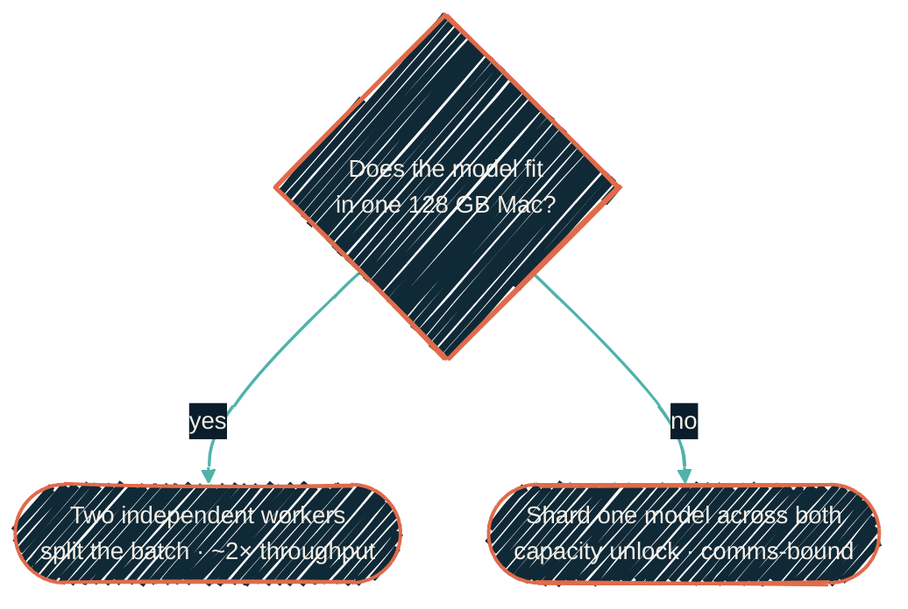

> Two Macs can *cooperate*; they can't *merge*. The win from a second machine is
> capacity — running a model too big for one box — not a faster version of one
> that already fits.

A second 128 GB Mac has arrived — it's already live as the always-on large-tier
serving host (see [Homelab GPU](/local-llm/homelab-gpu)). What hasn't landed yet
is using its Thunderbolt link to *shard* a model across both machines for
overnight, latency-tolerant batch work bigger than either can do alone. This
page is the honest version of how that would work — because the obvious mental
model is wrong in a way that changes the whole design.

## The one thing to get right

There is **no combined 256 GB unified-memory pool**. Apple Silicon unified memory
is a property of one chip; it can't be extended across a cable. What two Macs can
do is **shard a model** — each holds part of it — and exchange activations over a
fast interconnect. "Combined capacity" is real; "combined unified memory" is not.

The fast interconnect is the real, recent enabler. `mlx.distributed` moves data
between the Macs over Thunderbolt 5 two ways: the original **TCP ring** backend,
and a newer low-latency **RDMA backend (JACCL)** merged into MLX in late 2025
([ml-explore/mlx#2808](https://github.com/ml-explore/mlx/pull/2808)). Either way
the link moves bytes between two separate memory pools — it does not fuse them
into one.

| Path | Rough bandwidth | vs on-chip |
| --- | --- | --- |
| One M4 Max, unified memory (on-chip) | hundreds of GB/s | 1× |
| Thunderbolt 5 interconnect (RDMA/JACCL, measured) | a few GB/s | ~1/100–1/150 |

That ratio is the whole story. The link between the machines is two orders of
magnitude slower than memory inside one. Sharding pays its way only when the
alternative is *not running the model at all*.

## The decision: two workers, or one sharded model?



- **Fits in 128 GB → run two independent workers.** Put the model on each Mac,
  split the night's job list between them, and you get roughly double the
  aggregate throughput with none of the complexity. Simpler, and fault-isolated —
  if one node hiccups overnight, the other keeps going. This is the default for
  almost everything.
- **Doesn't fit → shard it.** Use `mlx.distributed` (or [EXO](https://github.com/exo-explore/exo),
  the friendlier wrapper over the same Apple primitives) to run one model across
  both machines. This is the only way to touch the aspirational tier — and it's a
  capacity unlock, accepted as slow.

## The honest fit math

"256 GB" is a ceiling, not a usable target. Sharding has per-node overhead, and
the KV cache needs room too.

**The split you get is tensor-parallel.** Weights shard across both nodes and
every layer's activations cross the link. That is the framework default and what
almost every model architecture implements. Pipeline parallelism — whole layers
per node, one activation hop per stage — is opt-in and implemented for only two
architectures, so you cannot pick a model on the assumption you will get it
(verified 2026-07-26/27).

That decides the sizing. A tensor-parallel split divides the weights but
multiplies the chatter, so the link ratio above is paid on every layer rather
than once per stage. Target a model whose weights leave each node under its own
128 GB with cache headroom — roughly the **~200–230 GB-weights range** on a
128 GB pair. Push toward a notional 256 GB and you starve the cache and fall
into swap.

## Capacity, not speed — and why overnight makes that fine

Sharded cross-Mac inference is communication-bound, so expect modest
tokens-per-second, not a multiplier. Community measurements on higher-bandwidth
Apple hardware land in the single-digit-to-low-teens tok/s range for large
sharded models; **the M4 Max pairing is unmeasured** and will be confirmed, not
assumed. For interactive use that's painful. For *overnight batch* it's the right
trade: a few hundred completions from a model that simply won't load on one
machine, done by morning, is a capability you otherwise don't have.

## Honest gotchas for unattended runs

Cross-machine inference is newer and more fragile than the single-Mac path. The
real risks for an overnight, unattended job:

- The Thunderbolt interconnect needs explicit one-time setup, and the bridge can
  reset across reboots and OS updates — a job that ran last week may need
  re-enabling.
- Long many-iteration runs have hit transport-resource exhaustion and GPU
  command-buffer timeouts in the wild.
- The RDMA backend has a **tiny, reboot-only** protection-domain budget, and
  every failed attempt permanently spends one — see below.
- macOS Local Network privacy can silently block the rendezvous entirely — see
  below.

### The RDMA protection-domain budget is 11, and it never refills

The RDMA backend allocates a kernel **protection domain** per rank. On Apple
Silicon that resource is far scarcer than it looks, and it is consumed by
*failure* as readily as by success.

Measured with `ibv_devinfo -v`, identically on every RDMA device of both Macs in
one deployment:

```text
max_pd: 11    max_qp: 11    max_cq: 11
```

Eleven. Not the ~60 concurrent sessions reported upstream in
[ml-explore/mlx#3207](https://github.com/ml-explore/mlx/issues/3207) — that
figure describes different hardware. **Run `ibv_devinfo -v` on your own machines
before designing around any number here;** treat 11 as one deployment's measured
fact, not an Apple Silicon constant.

Three properties make that budget dangerous:

- **Every `mx.distributed.init()` and teardown cycle leaks one** (mlx#3207). A
  *failed* init leaks one too. A worker that dials a coordinator which isn't up
  yet pays full price for learning nothing.
- **Only a reboot returns one.** There is no release call and no cleanup path.
  Running out shows up late and unhelpfully:
  `[jaccl] Changing queue pair to RTR failed with errno 96`.
- **You can't see how many are free.** `ibv_devinfo` reports the *maximum* a
  device can allocate, not what is allocated now, and other processes may hold
  some. The honest remaining budget is "unknown, and at most `11 - leaked`".

#### Two mechanisms any such system needs

**1. A reachability gate before you spend a domain.** Prove the peer is
reachable over a path that costs nothing — a plain TCP connect to the rendezvous
port, say — before you call `mx.distributed.init()`. Without that gate, "the
peer isn't up yet" turns a condition that fixes itself in seconds into permanent
resource loss. A precondition that fails should consume no budget at all.

**2. A debt cap that reserves budget, not one that just avoids exhaustion.**
Keep a boot-scoped ledger of domains known lost, and stop starting ranks at a cap
well below the device budget.

That second point is the non-obvious one, and it generalises. It is tempting to
set the cap just under the limit — 10 of 11 — because you have not run out yet.
That is wrong three times over:

- **A working session needs domains too.** The cap does not measure how close to
  empty you may get. It measures how much you may burn on failure and still
  afford the run you actually want.
- **Domains are not the only scarce pool.** `max_qp` and `max_cq` are 11 as
  well, and a live rank allocates queue pairs and completion queues alongside
  its protection domain. "Domains left" flatters "sessions left".
- **You cannot see the true remainder.** Free domains are unobservable, so a cap
  set against the measured maximum reasons from a number that was never a live
  count.

So hold back at least as many domains as you are willing to lose. In the
deployment above the cap is **5** of 11: five failed attempts still leave six
domains, which is a working session plus margin. A cap of 3 was over-cautious —
it halted a self-resolving "peer not up yet" with eight domains untouched. A cap
of 10 would clear the "not yet exhausted" bar and leave no room to succeed.

Assert that invariant in code rather than remembering it. *Reserve at least the
debt you tolerate* turns an over-confident cap into a build failure instead of a
3 a.m. reboot.

### macOS Local Network privacy silently blocks the rendezvous

macOS 26 default-denies **non-system, ad-hoc-signed binaries** from opening
local-subnet connections. A Python runtime installed by a package manager and
launched as a background `launchd` job is exactly that — and a background
process never gets to answer the Local Network permission prompt. That breaks
distributed-ML TCP rendezvous in a maddening way:

- **Symptom:** the worker's `connect()` times out (`errno 60`, `ETIMEDOUT`)
  while the coordinator binds its port and listens forever, never seeing a
  SYN. Once macOS records an explicit deny, the failure flips to a fast
  `errno 65` (`EHOSTUNREACH`). Meanwhile every sanity check "passes":
  `ping`, `curl`, `nc`, and `ssh` all work on the same link — those are
  Apple-signed platform binaries, which are exempt from the default deny.
- **Diagnostic:** try the same destination from an Apple binary
  (`/usr/bin/python3`) and from your ML runtime's Python. If the Apple binary
  connects and yours doesn't — on an up link with a populated ARP entry —
  it's Local Network privacy, not the firewall, the cable, or the framework.
- **Fix:** grant the runtime under System Settings → Privacy & Security →
  **Local Network** (a recorded deny makes the binary appear in that list).
  Loopback is exempt, so tunnelling the rendezvous port over system `ssh -L`
  avoids needing the grant at all. But the grant is keyed to the binary's
  **code-signing identity** — which is why it keeps coming back. See below.

### Code-signing identity decides which interpreter a scheduled job may use

A binary built by a content-addressed package manager has a signing identity
that *is* its content hash. Every dependency bump mints a binary the OS has
never seen and silently voids every prior privacy grant. The symptom is a
network failure indistinguishable from a pulled cable, and it recurs on a
cadence nobody associates with an outage: whenever you update.

So scheduled jobs deliberately launch through the **OS vendor's system
interpreter**, whose signing identity is stable across your updates. That trade
carries a hard cost — the vendor interpreter is old, a 3.x-era shell — and so a
hard requirement: **every shipped script must parse under it.**

Nothing enforced that, and two live violations were each the root cause of a
long-standing failure (verified 2026-07-26/27):

| Construct | What the old shell does | What it broke |
| --- | --- | --- |
| `case` inside `$( )` | ends the command substitution at the first `)` of a case *pattern* → syntax error, exit 0, raw script text on stdout | link and carrier detection returned garbage for weeks, so the cluster could never self-form |
| `mapfile` (a shell-4 builtin) | "command not found" and an empty array | an orphan-process reaper concluded "nothing to clean up" on every start, and the orphan survived |

Both failed **silently and successfully** — exit 0 with a wrong answer, which no
caller checks for. A CI compatibility check now scans every shipped script for
incompatible constructs, and it was mutation-tested: reinstating either bug
fails the build. See
[Verifying the instrument](/local-llm/verifying-the-instrument).

### Some resource debt is boot-scoped — stop, don't retry

The low-latency RDMA backend allocates protection domains. **Every failed
initialization leaks more of them, and nothing in user space frees them while
the host stays up.** A retry loop does not recover from this; it deepens the
debt until nothing can start at all.

The right response is to stop attempting and latch a halt marker scoped to this
boot. The marker clears itself at the next boot — which is also what clears the
leaked domains — and must never be cleared by hand to try again. Guards doing
exactly that were validated live-fire: three failed rank starts leaked three
domains, the halt latched, and the retry loop stopped (verified 2026-07-26/27).

One detail from that drill is the wider lesson. The push-notification path was
down at the time, so the halt was observable only by polling the state directory
for the marker file. **Never make a halt condition observable only through an
alerting channel that can itself be down.** Write a pollable on-host artifact
and let the alert be the convenience, not the record.

So the rule is: **prove an overnight job survives end-to-end before relying on
it.** That proof is a measurement task, not an assumption.

## Where this is gated

This is a near-term direction, not shipped fact. Before it becomes a documented
production capability it has to clear a measurement spike: confirm the
Thunderbolt distributed path (RDMA/JACCL) works on *this* M4 Max hardware (the
public benchmarks are all higher-end Macs), baseline a single Mac, compare
two-independent-workers against a sharded run on a real overnight workload, and
find the break-even model size. The numbers — and the decision — come from that,
tracked in the roadmap, not from this page.

The further horizon is moving the non-latency-sensitive work off the laptop
entirely onto a dedicated always-on inference server, so the workstation stays
responsive and the heavy batch runs elsewhere.

## Related

<CardGroup cols={2}>
  <Card title="Models & quantization" icon="layer-group" href="/local-llm/models-and-quantization">
    The aspirational tier — models too big for one Mac — that justifies sharding.
  </Card>
  <Card title="Apple Silicon stack" icon="microchip" href="/local-llm/apple-silicon">
    The single-Mac stack each worker runs.
  </Card>
  <Card title="Benchmarking" icon="gauge-high" href="/tools/mlx-benchmarks">
    Where the shard-vs-two-workers question gets settled with numbers.
  </Card>
  <Card title="Operational reference (private)" icon="lock" href="https://docs.dryvist.com">
    Host-specific setup and the measurement spike's real results.
  </Card>
</CardGroup>
